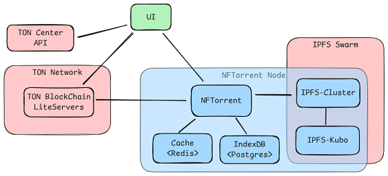

TON NFT Torrent HTTP Gateway
============================

Provides following HTTP API Gateway functions:
- read NFT `individual_content` data for known NFT collections
- read/write refrenced by NFT IPFS URI off-chain NFT files from Torrent maintained with IPFS Storage
- maintain Torrent redundacy and pinning policy


NFTorrent Application Architecture:

.

NFT Contract example: https://github.com/xeronm/pets-memorial

Feel free to support me with TON: `UQDJJHWJKrt7ZKiRzXz2TpzJMxJ5RrWffTqXL8769EXa_2bh`


### Getting Started

#### Build Docker image
```sh
pip intsall tox tox-docker
tox -e build
tox -e image
```

#### Deploy via Docker Compose

1. Create user
```sh
sudo groupadd -r nftorrent --gid=9001
sudo useradd -r -g nftorrent --uid=9001 --home-dir=/home/nftorrent --shell=/sbin/nologin nftorrent
```

2. Setup application directory
- create `ton_keystore` path
- create `storage-db` or `ipfs-db` path
- create `uploads` temporary path `mkdir /tmp/uploads`
- setup environment variables `.env`
- create `private` sub-directory, and place:
    - TON configuration, e.g. `wget https://ton.org/testnet-global-config.json`
    - generate `jwt.key` - JWT secret key for Bearer Authorization
    - TON Storage: create `storage.manifest` - BAG ID of the torrent to locate NFT Storage Peers


3. Run docker-compose
```sh
docker compose up -d
```

### Annex A. Useful Commands

```sh
openssl s_client \
  -connect 45.144.222.100:2379 \
  -cert /etc/ssl/pgcluster/client.crt \
  -key /etc/ssl/pgcluster/client.key \
  -CAfile /etc/ssl/pgcluster/ca.crt
```
